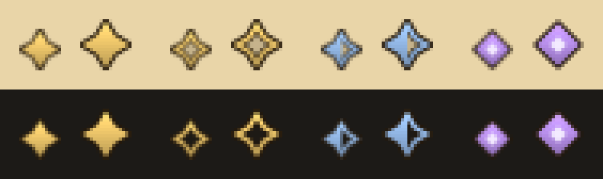

# ForeverQuest Marker

A World of Warcraft: Forever addon that tells you which quests are new in Forever and which
are carried over from original Classic.

Forever deliberately blends its 1,000+ new quests into familiar zones without marking them.
ForeverQuest Marker adds a small, Classic-styled marker so you can tell at a glance whether the
quest in front of you is one you have done a hundred times or something you have never seen.



| Marker                | Meaning                                                                                             |
| --------------------- | --------------------------------------------------------------------------------------------------- |
| Solid gold star       | **New in WoW Forever.** Confirmed from Forever client data or player reports.                       |
| Hollow gold star      | **Likely new.** Not in any Classic, Season of Discovery or Classic Era data, but not confirmed yet. |
| Half-filled blue star | **Changed.** An original Classic quest that players reported as modified in Forever.                |
| Violet diamond        | **Season of Discovery.** Not original Classic, but not new in Forever either.                       |
| No marker             | Original Classic quest.                                                                             |

The states differ by shape as well as color, and an option adds a short text label (New, New?,
Changed, SoD) for anyone who prefers words.

## Where markers appear

- **Quest window**: before the quest title when a quest giver offers, checks or completes a quest,
  and in quest details opened from the quest log or world map.
- **Quest giver lists**: on the corner of the quest icon in gossip and quest greeting windows.
- **Quest log**: on the corner of the quest's map marker button, left of the title.
- **Objective tracker**: on the corner of the tracked quest's map marker button.
- **Tooltips**: hovering any marker, a quest giver row, a quest log entry, a tracked quest, a world
  map quest pin, or a quest link in chat explains the state.

If another addon replaces the quest window (for example Immersion), the addon prints the quest's
state in chat instead, so you still get the information.

## How quests are classified

1. Quests reported as **changed** by players are marked as changed.
2. Quests in the **original Classic** quest list (QuestieDB) show no marker.
3. Quests **confirmed new** by player reports, or present in the Forever client's quest table but
   absent from the Classic Era client's, are marked new.
4. **Season of Discovery** quests get their own marker.
5. Other quests that exist in the **Classic Era** client (cut, unused and event quests) show no marker.
6. Anything left is **likely new**.

The current data comes from QuestieDB and the quest tables of Forever build 1.60.1.69977 and
Classic Era build 1.15.9.69722: 4,257 original Classic quests, 1,792 quests found only in the
Forever client, 928 Season of Discovery quests and 495 other Classic Era quests. `/fqm check <id>`
explains how any quest ID is classified. See [docs/DATA.md](docs/DATA.md) for details.

## Commands

| Command                                | What it does                                                                          |
| -------------------------------------- | ------------------------------------------------------------------------------------- |
| `/fqm`                                 | Open the settings (Game Menu, Options, AddOns).                                       |
| `/fqm check <questID>`                 | Explain how a quest ID is classified and why.                                         |
| `/fqm export`                          | Open your recorded quests as JSON, ready to copy. `/fqm export csv` for spreadsheets. |
| `/fqm status`                          | Show data versions, which windows are marked, and recorder counts.                    |
| `/fqm probe`                           | List the quests the addon sees in the windows that are open right now.                |
| `/fqm errors`                          | Show any errors the addon caught.                                                     |
| `/fqm tune <context> <size\|x\|y> <n>` | Adjust marker size or position live; `/fqm tune reset` restores defaults.             |
| `/fqm reset recorder`                  | Delete recorded quests (asks for confirmation).                                       |

## Helping the community list

The addon can remember the quests you meet that are not original Classic: ID, title, level, quest
giver, and where you were. Nothing leaves your computer unless you choose to share it. `/fqm export`
produces a document you can paste on the submission page,
<https://forever.swafox.com>; quests reported by several independent
players are promoted from "likely new" to "confirmed" in a later release. The export contains no
character name, realm or account data (see [docs/EXPORT_FORMAT.md](docs/EXPORT_FORMAT.md)). You can
turn recording off in the settings.

## Installation

Install from CurseForge or Wago Addons with your addon manager, or download a release zip and extract
the `ForeverQuestMarker` folder into the Forever client's `Interface\AddOns` folder. The addon has no
dependencies.

## Development

Requirements: [Bun](https://bun.sh), LuaJIT or Lua 5.1, [busted](https://lunarmodules.github.io/busted/)
and [luacheck](https://github.com/lunarmodules/luacheck) (`luarocks install busted luacheck`).

```sh
bun install
busted                                   # Lua specs, including a client emulation of every hooked frame
luacheck .                               # lint
bun test tools && bun run typecheck      # tooling tests
bun tools/generate-data.ts               # regenerate Data/*.lua from the pins in dataset/sources.json
bun tools/generate-data.ts --update      # move the pins to the newest QuestieDB and client builds
bun tools/generate-media.ts              # redraw Media/*.tga and the previews in docs/media
bun tools/verify-ui-source.ts --clone    # check every UI assumption against the Forever FrameXML
scripts/install-dev.sh --link "<path to Interface/AddOns>"   # try it in game
```

[docs/ARCHITECTURE.md](docs/ARCHITECTURE.md) describes the modules and how each window is hooked,
[docs/TESTING.md](docs/TESTING.md) the in-game test checklist, [docs/PIPELINE.md](docs/PIPELINE.md)
the community submission pipeline, and [AGENTS.md](AGENTS.md) the project rules.

## Credits and license

Original Classic and Season of Discovery quest IDs are derived from
[QuestieDB](https://github.com/Questie/QuestieDB), the database behind
[Questie](https://github.com/Questie/Questie) (distributed on CurseForge under the GNU GPL v3).
Only quest ID numbers are used; no Questie text or code is included. Client quest tables come from
[wago.tools](https://wago.tools). The client UI source used to verify every hook is mirrored at
[Gethe/wow-ui-source](https://github.com/Gethe/wow-ui-source).

ForeverQuest Marker is free software under the GNU General Public License v3.0 or later; see
[LICENSE](LICENSE). World of Warcraft is a trademark of Blizzard Entertainment; this project is not
affiliated with Blizzard.
